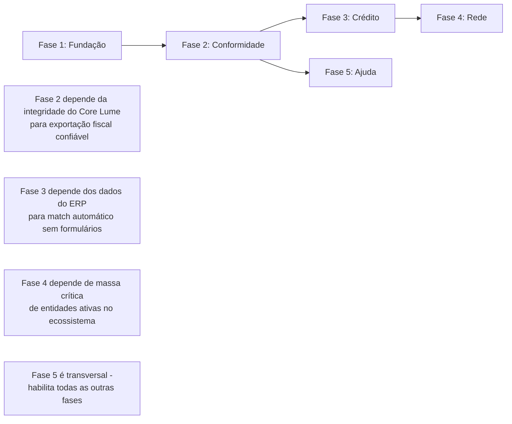

title: Roadmap de Produto - Ecossistema Digna
status: implemented
version: 3.2
last_updated: 2026-03-27
---

# Roadmap de Produto - Ecossistema Digna

> **Nota:** Este roadmap reflete a visão integrada do Ecossistema Digna (PDF v1.0), preservando todo o trabalho validado nas Sprints 1-16, incorporando os novos módulos como Fases 3 e 4, e incluindo o Sistema de Ajuda Educativa (RF-30) decidido na sessão de 27/03/2026.

---

## 🗺️ Visão Geral das Fases

```
┌─────────────────────────────────────────────────────────────────────────┐
│                    ROADMAP ECOSSISTEMA DIGNA                            │
├─────────────────────────────────────────────────────────────────────────┤
│                                                                         │
│  FASE 1 — FUNDAÇÃO (✅ COMPLETE)                                        │
│  ├── Sprint 01-06: Core Contábil + PDV + Ledger                         │
│  ├── Sprint 07-12: Contador Social + SPED                               │
│  └── Sprint 13-16: Supply + Budget + UI 100%                            │
│                                                                         │
│  FASE 2 — CONFORMIDADE ESTATAL (🟡 EM ANDAMENTO)                        │
│  ├── RF-14: EFD-Reinf + ECF (Blindagem Tributária)                     │
│  ├── RF-15: Gov.br + Assembleias Digitais                              │
│  ├── RF-16: MTSE/MAPA (Inclusão Sanitária)                             │
│  └── RF-17: CADSOL/SINAES Automático                                   │
│                                                                         │
│  FASE 3 — ECOSSISTEMA DE CRÉDITO (📋 NOVO - PDF v1.0)                   │
│  ├── RF-18: Motor de Indicadores (BCB, IBGE APIs)                      │
│  ├── RF-19: Perfil de Elegibilidade (campos complementares)            │
│  ├── RF-20: Portal de Oportunidades (MVP: 3 programas)                 │
│  └── RF-21: Checklist + Alertas de Documentos                          │
│                                                                         │
│  FASE 4 — REDE DE INTERCOOPERAÇÃO (📋 NOVO - PDF v1.0)                  │
│  ├── RF-24: Perfil Público da Entidade                                 │
│  ├── RF-25: Mural de Necessidades                                      │
│  └── RF-26: Match de Oportunidades B2B                                 │
│                                                                         │
│  FASE 5 — AJUDA E PEDAGOGIA (📋 NOVO - Decisão 27/03/2026)              │
│  └── RF-30: Sistema de Ajuda Educativa Estruturada                     │
│                                                                         │
└─────────────────────────────────────────────────────────────────────────┘
```

---

## 📋 Detalhamento por Fase

### Phase 1: Foundational (Fundação e Operação)
**Status:** ✅ COMPLETE  
**Objetivo:** Prover a infraestrutura básica de operação contábil e a "Contabilidade Invisível".

**Entregas:**
* [x] PDV operacional com interface pedagógica (RF-02)
* [x] Motor de partidas dobradas e Soma Zero em int64 (Core Lume) (RF-01)
* [x] Registro de horas e valoração do suor ITG 2002 (RF-03)
* [x] Lifecycle Manager (SQLite isolado por tenant) (RNF-01)
* [x] Dashboard de dignidade e transparência algorítmica
* [x] Interface web PWA (Offline-first) (RNF-03)
* [x] Gestão de membros
* [x] Testes E2E BDD (Jornada Anual "Sonho Solidário")

**Maturidade:** Sistema operacional empoderando grupos informais a gerirem seus negócios com rigor, mas sem jargões.

---

### Phase 2: Integração Institucional e Aliança Contábil
**Status:** 🟡 EM DESENVOLVIMENTO  
**Objetivo:** Automatizar a transição de grupos informais para entidades formalizadas e criar a ponte tecnológica estrutural com os Contadores Sociais (CFC/CRCs) e órgãos de conformidade (MAPA, RFB, MTE).

**Entregas Concluídas:**
* [x] Simulador de formalização e algoritmos de gatilho
* [x] Geração de atas (Markdown com Hash SHA256)
* [x] Transição automática DREAM → FORMALIZED
* [x] Integrações governamentais (Mocks via Clean Architecture)
* [x] Painel do Contador Social (Accountant Dashboard): Interface Multi-tenant Read-Only para auditores voluntários ✅ SPRINT 12
* [x] Exportação Fiscal (SPED): Motor de tradução das partidas dobradas para leiautes contábeis ✅ SPRINT 12
* [x] Gestão de Compras e Estoque (RF-07, RF-08) ✅ SPRINT 13-14
* [x] Gestão Orçamentária com alertas visuais (RF-10) ✅ SPRINT 14

**Entregas Pendentes (Adequação Estatal - NOVO):**
* [ ] **RF-14: Blindagem Tributária (EFD-Reinf e ECF)** 
  * Módulo `tax_compliance` para mensageria de retenções via Web Service
  * Expurgo automático de receitas de Atos Cooperativos no Bloco M da ECF (Lei 5.764/71 e LC 214/2025)
* [ ] **RF-15: Integração Real Gov.br e Governança Digital**
  * Substituição do Mock de login unificado pelo fluxo real da Cidadania Digital (OAuth2)
  * Assinatura Eletrônica Qualificada (Lei nº 14.063/2020) para mesas de Assembleia
  * Algoritmo de anonimização sistêmica para escrutínio secreto em votações (IN DREI nº 79/2020)
* [ ] **RF-16: Inclusão Sanitária (MAPA)**
  * Módulo `sanitary_compliance` para geração automatizada do Memorial Técnico Sanitário de Estabelecimento (MTSE)
  * Conformidade com Portaria MAPA nº 393/2021 para agroindústrias
* [ ] **RF-17: Integração CADSOL/SINAES Automático**
  * Consumo nativo de Web Services do MTE (Decreto nº 12.784/2025)
  * Matrícula automática de entidades FORMALIZED no Cadastro Nacional de Economia Solidária

**Maturidade:** Grupos informais tornam-se visíveis ao Estado e amparados legalmente pela classe contábil, sem a necessidade de o produtor virar um "digitador de notas". A arquitetura garante Soberania do Dado com acesso read-only para contadores.

---

### Phase 3: Ecossistema de Crédito e Indicadores [NOVO - PDF v1.0]
**Status:** 📋 BACKLOG (Prioridade Alta)  
**Objetivo:** Conectar automaticamente o empreendedor aos programas de crédito para os quais ele já é elegível, sustentado por dados econômicos atualizados em tempo real.

**Princípio Central:** Nenhum usuário precisa preencher o mesmo dado duas vezes. O perfil capturado pelo ERP alimenta automaticamente o Portal.

#### RF-18: Motor de Indicadores Econômico-Financeiros
| Sub-requisito | Descrição | Fonte de Dados | Prioridade |
|--------------|-----------|---------------|------------|
| RF-18.1 | Coleta de SELIC, IPCA, CDI | BCB SGS API | Alta |
| RF-18.2 | Câmbio oficial (USD/BRL, EUR/BRL) | BCB PTAX API | Alta |
| RF-18.3 | Expectativas de mercado (Focus) | BCB Focus API | Média |
| RF-18.4 | Indicadores sociais (PNAD, desocupação) | IBGE SIDRA | Média |
| RF-18.5 | Cache local e interpretação contextual | Arquitetura interna | Alta |

**Arquitetura Proposta:**
```
modules/
└── indicators_engine/          # NOVO MÓDULO
    ├── internal/
    │   ├── collector/          # Scheduler de coleta (cron diário)
    │   ├── cache/              # Tabela indicators{} com TTL
    │   ├── interpreter/        # Regras de negócio contextualizadas
    │   └── repository/         # SQLite local (cache-proof)
    ├── pkg/
    │   └── indicators/         # API pública para outros módulos
    └── cmd/
        └── collector/          # Binário independente para coleta
```

#### RF-19: Perfil de Elegibilidade (Campos Complementares)
**Descrição:** Expandir o modelo de dados do ERP para capturar informações necessárias ao match de crédito, com preenchimento único e reutilização automática.

**Novos Campos (struct `EligibilityProfile`):**
```go
type EligibilityProfile struct {
    // Já existentes no ERP (capturados automaticamente)
    CNPJ             string
    CNAE             string
    Municipio        string
    UF               string
    FaturamentoAnual int64  // int64 - Anti-Float compliance
    RegimeTributario string
    DataAbertura     time.Time
    SituacaoFiscal   string
    
    // NOVOS CAMPOS (preenchimento único pelo usuário/contador)
    InscritoCadUnico    bool     // Habilita programas sociais
    SocioMulher         bool     // Prioridade em linhas com foco de gênero
    InadimplenciaAtiva  bool     // Direciona ao Desenrola antes de crédito novo
    FinalidadeCredito   string   // CAPITAL_GIRO, EQUIPAMENTO, REFORMA, OUTRO
    ValorNecessario     int64    // int64 - Anti-Float compliance
    TipoEntidade        string   // MEI, ME, EPP, Cooperativa, OSC, OSCIP, PF
    ContabilidadeFormal bool     // Requisito de alguns programas
}
```

#### RF-20: Portal de Oportunidades (MVP - 3 Programas)
**Programas Prioritários para MVP:**
| Programa | Valor Máximo | Público-Alvo | Diferencial |
|----------|-------------|--------------|-------------|
| **Acredita no Primeiro Passo** | ~R$ 6 mil | CadÚnico, 70% mulheres | Sem garantia, juros subsidiados |
| **Pronampe** | Até 30% da receita bruta | MEI, ME, EPP | Prazo até 84 meses, carência 24 meses |
| **Niterói Empreendedora** | Até R$ 200 mil | CNPJ ativo 12+ meses em Niterói | **JUROS ZERO**, foco em mulheres e jovens |

**Funcionalidades do MVP:**
* [ ] **Match Automático:** Cruzamento do perfil do ERP com requisitos de cada programa
* [ ] **Ranqueamento por Vantagem:** Ordenação por custo efetivo de capital (usando taxas do Motor)
* [ ] **Checklist de Documentos:** Para cada linha elegível, marca o que já está no Digna vs. o que falta
* [ ] **Alertas de Prazo:** Notificações quando editais com alto match têm prazo próximo

#### RF-21: Checklist + Alertas de Documentos
* [ ] Integração com portais de certidões (PGFN, Estadual, Municipal) para verificação automática
* [ ] Scraping do Diário Oficial da União (DOU) para captura de novos editais
* [ ] Sistema de notificações push/email para prazos críticos

**Maturidade Esperada:** O empreendedor descobre oportunidades de crédito sem preencher formulários repetitivos. O sistema faz o trabalho pesado de cruzar dados e informar elegibilidade.

---

### Phase 4: Rede de Intercooperação [NOVO - PDF v1.0]
**Status:** 📋 BACKLOG (Prioridade Baixa - depende de massa crítica)  
**Objetivo:** Conectar entidades do ecossistema em uma rede de apoio mútuo, materializando o 6º Princípio do Cooperativismo.

**Fundamento Teológico:** Koinonía — comunhão e partilha mútua. Não é apenas um marketplace: é uma ecclesia econômica onde entidades que compartilham valores se apoiam mutuamente.

#### RF-24: Perfil Público da Entidade
**Descrição:** Permitir que entidades publiquem informações visíveis para a rede, sem expor dados sensíveis.

**Campos do Perfil Público:**
```go
type PublicProfile struct {
    EntityID        string   // Hash anonimizado
    NomeFantasia    string
    Missao          string   // Texto livre
    Produtos        []string // Lista de categorias
    Servicos        []string // Lista de capacidades
    Municipio       string
    UF              string
    ContatoPublico  string   // Email/telefone para negócios
    FotoLogo        string   // URL do asset
}
```

#### RF-25: Mural de Necessidades
**Descrição:** Entidades publicam demandas de compra visíveis para a rede.

**Estrutura de Postagem:**
```go
type NeedPost struct {
    ID             string
    PublisherID    string   // Hash anonimizado
    Categoria      string   // INSUMO, EQUIPAMENTO, SERVICO, OUTRO
    Descricao      string
    Quantidade     string
    PrazoDesejado  time.Time
    Municipio      string   // Para matching geográfico
    Status         string   // ABERTO, EM_NEGOCIACAO, CONCLUIDO
    CreatedAt      time.Time
}
```

#### RF-26: Match de Oportunidades B2B
**Descrição:** Algoritmo que sugere conexões entre quem precisa e quem oferece.

**Critérios de Matching:**
1. **Geográfico:** Priorizar proximidade (mesmo município/UF)
2. **Setorial:** Afinidade de CNAE/categoria
3. **Temporal:** Prazos compatíveis
4. **Reputação:** Histórico de transações na rede (futuro)

**Maturidade Esperada:** Redução de custos de aquisição para as entidades e fortalecimento da economia local através da intercooperação.

---

### Phase 5: Ajuda e Pedagogia [NOVO - Decisão da Sessão 27/03/2026]
**Status:** 📋 BACKLOG (Prioridade Média - Habilita adoção por baixa escolaridade)  
**Objetivo:** Traduzir conceitos técnicos (CadÚnico, inadimplência, CNAE, etc.) em linguagem popular, com linkagem entre elementos de UI e registros de ajuda no banco.

**Fundamento:** Pilar 2 (Tradução Cultural) + Pilar 5 (Ferramenta Pedagógica) do Digna.

#### RF-30: Sistema de Ajuda Educativa Estruturada
**Descrição:** Sistema de ajuda contextual que traduz conceitos técnicos em linguagem popular, com linkagem entre elementos de UI e registros de ajuda no banco.

**Funcionalidades:**
* [ ] Entrada de menu "Ajuda" acessível em todas as páginas
* [ ] Busca e índice de tópicos categorizados (CRÉDITO, TRIBUTÁRIO, GOVERNANÇA, GERAL)
* [ ] Explicação em linguagem popular + legislação relacionada + próximo passo acionável
* [ ] Linkagem automática: botão "?" ao lado de campos técnicos abre explicação contextual
* [ ] Tópicos com estrutura: Título, Resumo, Explicação, Por que perguntamos, Legislação, Próximo passo, Link oficial

**Arquitetura Proposta:**
```
modules/
└── help_engine/                # NOVO MÓDULO
    ├── internal/
    │   ├── domain/
    │   │   └── help_topic.go   # Entidade HelpTopic
    │   ├── service/
    │   │   └── help_service.go # Lógica de busca/índice
    │   └── repository/
    │       └── help_repository.go # Persistência SQLite (central.db)
    └── pkg/
        └── help/
            └── help.go         # API pública
```

**Tópicos Educativos Obrigatórios (Seed Inicial):**
| Tópico | Categoria | Explicação Popular |
|--------|-----------|-------------------|
| CadÚnico | CRÉDITO | "É o cadastro do governo para programas sociais" |
| Inadimplência | CRÉDITO | "É quando há dívidas não pagas registradas" |
| CNAE | TRIBUTÁRIO | "É o código que diz qual é a atividade do seu negócio" |
| DAS MEI | TRIBUTÁRIO | "É o boleto mensal que o MEI paga" |
| Reserva Legal | GOVERNANÇA | "É uma parte do lucro que a lei manda guardar" |
| FATES | GOVERNANÇA | "É um fundo para ajudar outros grupos a se organizarem" |

**Critério de Aceite Pedagógico:**
* [ ] Usuário com 5ª série consegue entender a explicação sem ajuda externa
* [ ] Tooltip carrega em < 500ms via HTMX
* [ ] Conteúdo não usa jargões técnicos ("cadastramento", "regularização fiscal", etc.)
* [ ] Sempre inclui "próximo passo" acionável (ex: "procure o CRAS")

**Maturidade Esperada:** Redução de abandono em formulários, empoderamento do usuário através da educação contextual, reutilização do padrão em todos os módulos.

---

## 📊 Matriz de Priorização (Impacto × Esforço)

```
                    ALTO IMPACTO
                         │
         ┌───────────────┼───────────────┐
         │  RF-19        │  RF-18        │
         │  (Perfil)     │  (Indicadores)│
         │               │               │
ESFORÇO  │               │               │  ESFORÇO
BAIXO    │   🎯 RF-30    │               │  ALTO
         │   (Ajuda)     │               │
         ├───────────────┼───────────────┤
         │  RF-27        │  RF-20        │
         │  (DAS MEI)    │  (Portal)     │
         │               │               │
         └───────────────┼───────────────┘
                         │
                    BAIXO IMPACTO
```

**Recomendação de Sequência:**
1. **RF-27 (DAS MEI)** — Baixo esforço, alto valor percebido, prepara terreno para Portal
2. **RF-30 (Sistema de Ajuda)** — Baixo esforço, habilita adoção por baixa escolaridade, transversal a todos os módulos
3. **RF-19 (Perfil de Elegibilidade)** — Habilita o match automático do Portal
4. **RF-18 (Motor de Indicadores)** — Fornece contexto macroeconômico para decisões
5. **RF-20 (Portal MVP)** — Entrega valor imediato com 3 programas validados

---

## 🗓️ Marcos (Milestones) Atualizados

| Marco | Fase | Status | Previsão | Dependências |
|-------|------|--------|----------|-------------|
| MVP Operacional | 1 | ✅ COMPLETE | 03/2026 | - |
| Formalização Beta | 2 | ✅ COMPLETE | 03/2026 | Fase 1 |
| E2E Journey Tests | 1-2 | ✅ COMPLETE | 03/2026 | Fase 1 |
| Painel do Contador & SPED | 2 | ✅ COMPLETE | 03/2026 | Fase 1 |
| Gestão de Compras e Estoque | 3 | ✅ COMPLETE | 03/2026 | Fase 1 |
| **Adequação Estatal (RFB, MAPA, MTE)** | 2 | 🟡 EM DESENVOLVIMENTO | 05/2026 | Fase 2 base |
| **Sistema de Ajuda (RF-30)** | 5 | 📋 BACKLOG | 06/2026 | Nenhum |
| **Motor de Indicadores (RF-18)** | 3 | 📋 BACKLOG | 07/2026 | Fase 2 concluída |
| **Perfil de Elegibilidade (RF-19)** | 3 | 📋 BACKLOG | 08/2026 | RF-30, RF-18 |
| **Portal MVP (RF-20)** | 3 | 📋 BACKLOG | 10/2026 | RF-18, RF-19 |
| Gestão Financeira Territorial | 3 | 🔵 PLANNED | 2027 | Fase 3 |
| Perfil Público + Mural (RF-24, RF-25) | 4 | 🔵 PLANNED | 2027 | Massa crítica de usuários |
| Rede Nacional (RF-26) | 4 | 🔵 PLANNED | 2028 | Fase 4 base |

---

## 🔗 Dependências entre Fases



**Notas Arquiteturais Críticas:**
1. **Soberania do Dado:** Cada fase deve preservar o isolamento físico dos bancos SQLite por entidade. Nenhum módulo pode violar este princípio.
2. **Anti-Float:** Todos os cálculos financeiros e de tempo devem usar `int64`. Esta regra é transversal a todas as fases.
3. **Cache-Proof Templates:** A interface web deve continuar carregando templates do disco via `ParseFiles()` no handler, garantindo atualizações imediatas.
4. **Nenhum Dado Digitado Duas Vezes:** Novos módulos devem **consumir** dados do ERP, nunca exigir reentrada. Este é o princípio central do PDF v1.0.
5. **Pedagogia Contextual (RF-30):** Todo campo técnico deve ter explicação acessível via botão "?" linkado ao help_engine.

---

## 🎯 Critérios de Sucesso por Fase

| Fase | Métrica de Sucesso | Alvo |
|------|-------------------|------|
| Fase 1 | Entidades operando com contabilidade invisível | 100+ entidades ativas |
| Fase 2 | Entidades com conformidade estatal automatizada | 80% das formalizadas |
| Fase 3 | Entidades descobrindo elegibilidade via Portal | 50+ matches bem-sucedidos |
| Fase 4 | Transações B2B realizadas na Rede | 200+ conexões/ano |
| Fase 5 | Redução de abandono em formulários | 30% redução |
| Fase 5 | Tópicos de ajuda visualizados/mês | 500+ visualizações |

---

## ⚠️ Riscos e Mitigações

| Risco | Probabilidade | Impacto | Mitigação |
|-------|--------------|---------|-----------|
| APIs governamentais instáveis | Alta | Médio | Cache local + circuit breaker + modo offline |
| Complexidade do Portal cresce além do MVP | Média | Alto | MVP com 3 programas primeiro; validação com usuários reais |
| Conflito de naming (ERP vs. Ecossistema) | Baixa | Baixo | Documentar claramente a hierarquia de módulos |
| Massa crítica para Rede Digna não atingida | Alta | Médio | Focar em ERP + Portal primeiro; Rede como "nice-to-have" |
| Teologia afeta adoção secular | Média | Alto | Manter produto laico na interface; teologia informa design internamente |
| Dependência de contadores sociais para escala | Média | Alto | Criar programa de capacitação + certificação CFC |
| **Linguagem muito técnica nos tópicos de ajuda (RF-30)** | Alta | Alto | Revisão por ITCPs/comunidade; teste de usabilidade com usuários reais |
| **Conteúdo de ajuda desatualizado** | Média | Médio | Processo de atualização via central.db, não hardcoded |

---

## 📝 Notas de Governança

- **Fundação Providentia:** Guardiã da neutralidade e missão social do ecossistema
- **Licença:** Apache 2.0 (código aberto, uso comercial permitido)
- **Marca "Digna":** Pertence exclusivamente à Fundação Providentia
- **Modelo de Governança:** Inspirado na Apache Foundation, com mérito técnico e domínio do negócio

---

## 🔄 Próximos Documentos a Atualizar (Fila de Trabalho)

Para manter o nosso sistema PKM (Personal Knowledge Management) 100% íntegro com esta expansão de requisitos, os seguintes documentos precisarão de ajustes em sequência:

1. `docs/06_roadmap/03_backlog.md`: (Inserir RF-30 na "Alta Prioridade" com detalhes)
2. `docs/02_product/02_models.md`: (Modelagem de dados: inserir `HelpTopic`)
3. `docs/03_architecture/01_system.md`: (Atualizar arquitetura para incluir help_engine)
4. `docs/03_architecture/02_protocols.md`: (Protocolos de linkagem UI → help_engine)

---

**Status:** ✅ ATUALIZADO COM VISÃO DE ECOSSISTEMA (PDF v1.0) + RF-30 (Decisão de Design 27/03/2026)  
**Próxima Ação:** Atualizar `06_roadmap/03_backlog.md` com RF-30 detalhado  
**Versão Anterior:** 3.1 (2026-03-27)  
**Versão Atual:** 3.2 (2026-03-27)
